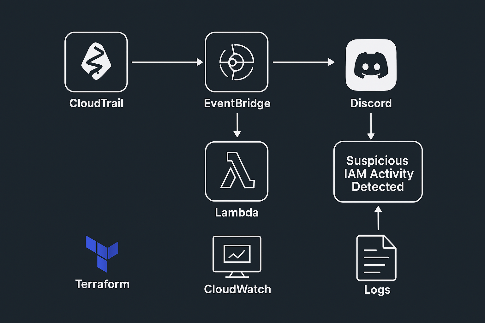
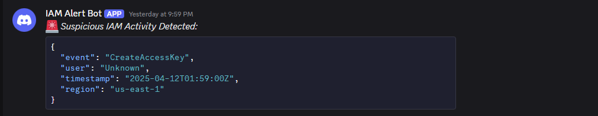
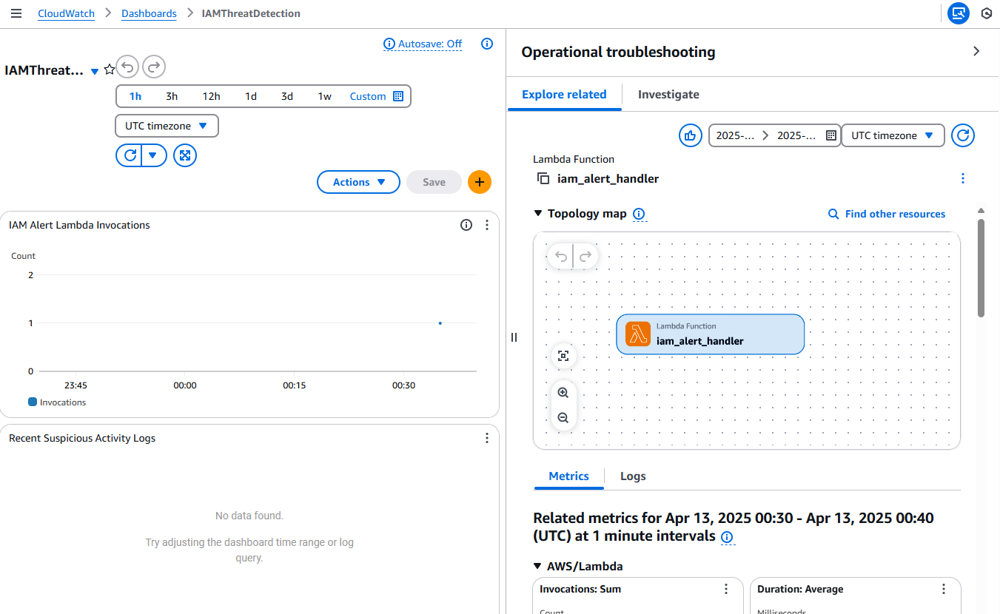

# 🔐 Serverless Threat Detection Pipeline


This project showcases a real-time, serverless security monitoring pipeline built entirely with AWS-native tools. It detects suspicious IAM activity using CloudTrail and EventBridge, then sends alerts to a Discord channel via a lightweight Python-based Lambda function. The system also includes a CloudWatch dashboard for visibility into pipeline performance.

## 🧱 Architecture

- **AWS CloudTrail** logs IAM activity across the AWS account.
- **Amazon EventBridge** detects specific API calls in real-time.
- **AWS Lambda** processes the events and sends alerts to Discord.
- **AWS CloudWatch** monitors activity and provides operational insight.



## 🚀 Why This Project Matters

This project demonstrates how to:
- Detect high-risk IAM activity like `CreateAccessKey` or `DeleteUser`
- Automate incident detection using AWS native event-driven architecture
- Deploy a fully serverless monitoring system
- Visualize metrics and logs in a clean CloudWatch dashboard

## ⚙️ Technologies Used

- AWS Lambda (Python)
- AWS EventBridge
- AWS CloudTrail
- AWS CloudWatch + Dashboard
- Terraform (IaC)
- Discord Webhook (for alerting)

## 🧑‍💻 How It Works

1. **IAM event occurs** → CloudTrail logs it
2. **EventBridge Rule** matches sensitive IAM actions
3. **Lambda** is triggered and sends the alert to Discord
4. **CloudWatch Dashboard** updates with metrics and logs

## ✅ Example Discord Alert



```json
{
  "event": "CreateAccessKey",
  "user": "unauthorized_user",
  "timestamp": "2025-04-10T13:44:12Z",
  "region": "us-east-1"
}
```

## 📈 Dashboard



- 📊 **Invocation chart** shows alert activity over time
- 📄 **Live logs** show raw detection alerts in real time

Accessible via CloudWatch → Dashboards → `IAMThreatDetection`

## 🚀 Deployment Instructions

1. Clone this repo
2. Set your Discord webhook in AWS Lambda under `WEBHOOK_URL`
3. Run:
   ```bash
   terraform init
   terraform apply -var-file="terraform.tfvars"
   ```
4. Create a test IAM access key or attach a user policy
5. View the alert in Discord and logs in CloudWatch

## 👨‍💻 Built For Employers

This project is meant to demonstrate practical, cloud-native security automation using infrastructure as code and serverless design patterns. It's lean, modular, and ready for extension.
